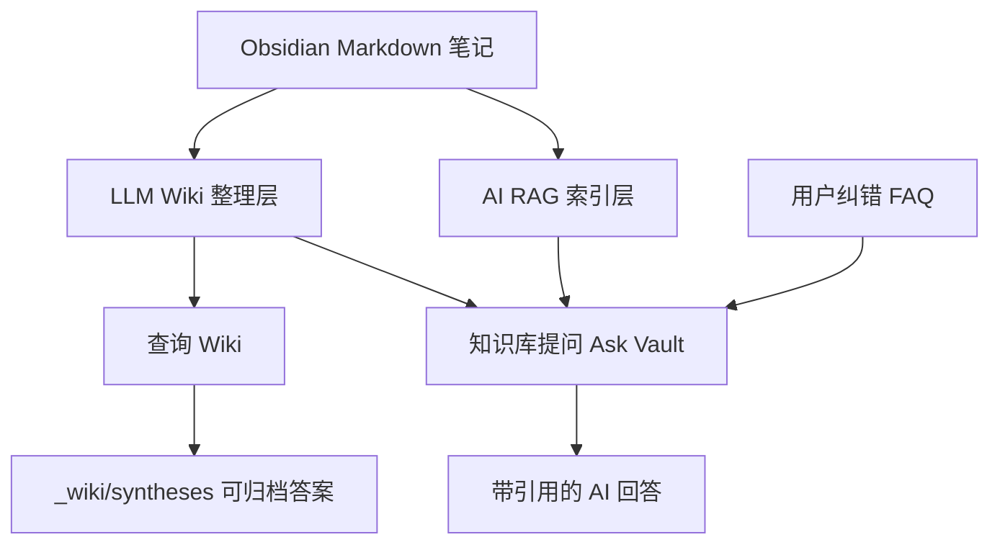
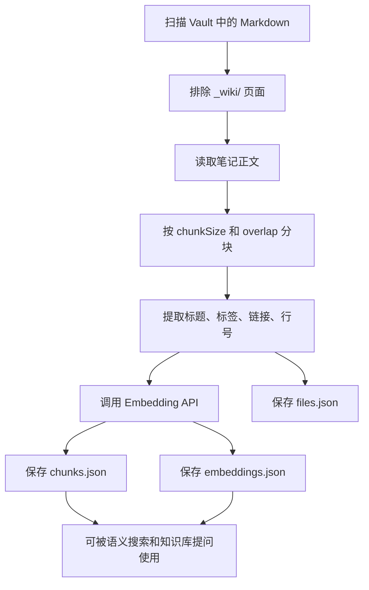
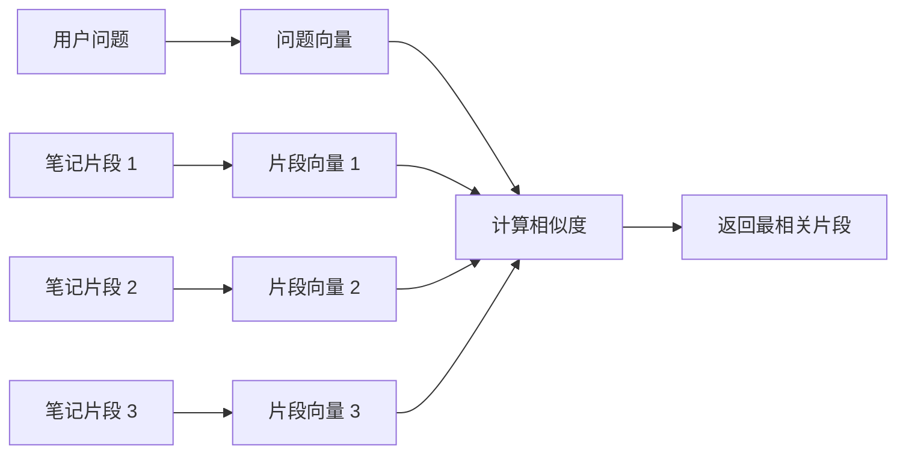
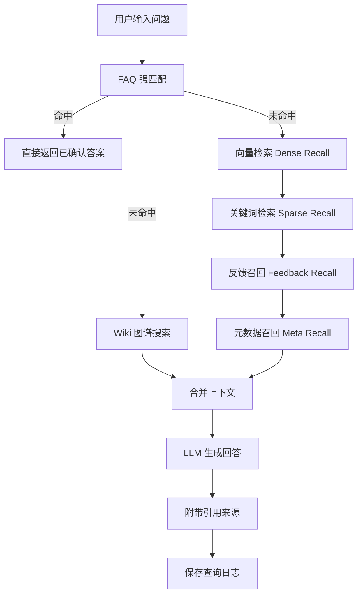
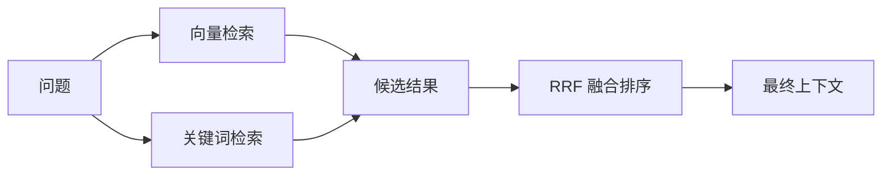
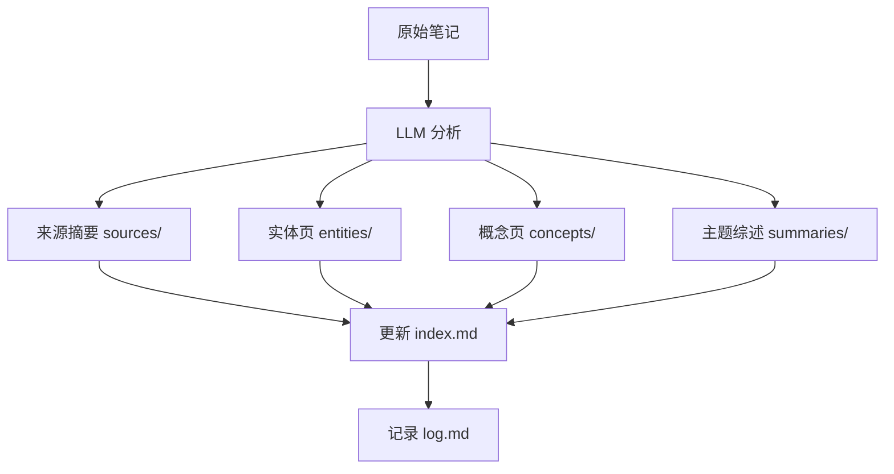
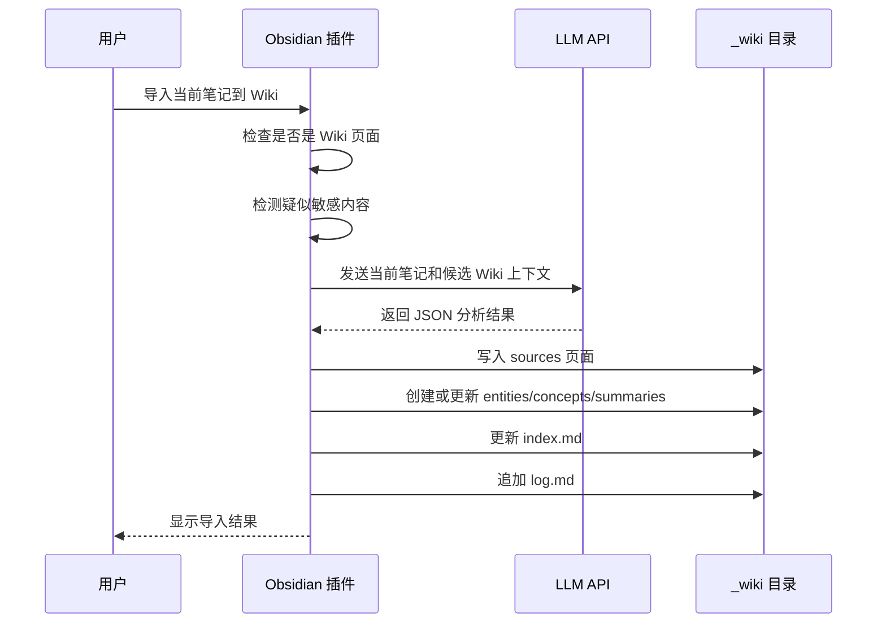
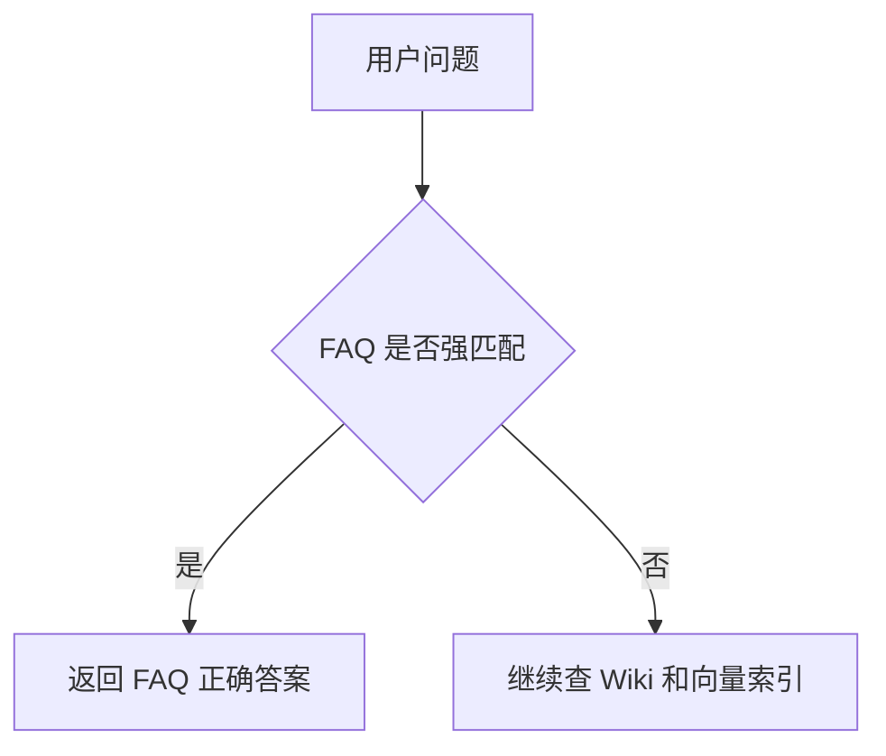

# AI RAG + LLM Wiki 底层原理图解

这份文档解释插件背后的工作机制。你不需要懂算法也能读懂。

## 1. 总体架构



插件有三类知识来源：

- 原始笔记：你的 Markdown 文件。
- RAG 索引：从原始笔记切块、向量化得到的检索数据。
- LLM Wiki：LLM 整理出来的 `_wiki/` Markdown 页面。

## 2. RAG 是什么

RAG 是 Retrieval-Augmented Generation，意思是“检索增强生成”。

普通 AI 问答：

```text
问题 -> AI 直接回答
```

RAG 问答：

```text
问题 -> 先从你的笔记里找资料 -> 把资料和问题一起交给 AI -> 回答
```

这样 AI 更容易基于你的资料回答，而不是凭空编。

## 3. 构建索引流程



关键文件保存在：

```text
.obsidian/plugins/obsidian-ai-rag-plugin/data/
```

主要文件：

- `chunks.json`：每个文本块的正文、来源路径、标题、行号。
- `embeddings.json`：每个文本块对应的向量。
- `files.json`：文件修改时间和分块 ID。
- `manifest.json`：索引版本、模型、分块参数。

## 4. Embedding 是什么

Embedding 可以理解为“把文字变成一串数字”。

例如：

```text
"公司服务器怎么配置" -> [0.12, -0.08, 0.33, ...]
```

语义相近的文本，数字向量也会更接近。插件用余弦相似度找最相近的笔记片段。



## 5. 知识库提问流程



插件的检索不是只有一种方式，而是多路召回：

- FAQ：你纠正过并确认的答案，优先级最高。
- Wiki：整理后的结构化知识。
- Dense Recall：向量语义检索。
- Sparse Recall：关键词检索。
- Feedback Recall：历史纠错记忆。
- Meta Recall：AI 摘要元数据。

## 6. 混合搜索为什么更稳

向量检索擅长理解意思，比如“服务器登录方式”和“SSH 连接”可能语义接近。

关键词检索擅长精确命中，比如 IP、产品名、命令、报错信息。

混合搜索把两者结合：



## 7. LLM Wiki 的工作方式

传统 RAG 每次都临时找片段，知识不会被真正整理。LLM Wiki 会把重要知识沉淀成 Markdown 页面。



Wiki 页面类型：

- `sources/`：原始来源摘要，连接原文和 Wiki。
- `entities/`：人物、组织、项目、工具、产品、地点。
- `concepts/`：理论、方法、原则、模式。
- `summaries/`：跨多个来源的主题综述。
- `syntheses/`：值得长期保存的问答和综合分析。
- `faq/`：用户确认过的标准答案。
- `meta/`：每篇原始笔记的整理性说明。
- `relations/`：笔记和 Wiki 的关系表。

## 8. 导入 Wiki 的详细流程



## 9. FAQ 为什么优先级最高

FAQ 来自用户纠错，是“人确认过的答案”。所以插件问答时会先查 FAQ。



这能让插件越用越贴合你的知识库。

## 10. 敏感内容处理

插件会检测这些关键词或模式：

- password
- passwd
- api key
- secret
- token
- private key
- 密码
- 密钥
- 令牌
- 身份证
- 银行卡

遇到疑似敏感笔记时，手动任务会提示你选择：

- 跳过：不处理这篇笔记。
- 正常处理：发送正文给 AI。
- 标记为私密：不发送正文，只在 Wiki 里记录一个私密占位页。

后台自动任务遇到敏感内容会跳过，不会弹大量确认框。

## 11. 数据保存在哪里

插件运行数据保存在：

```text
你的 Vault/.obsidian/plugins/obsidian-ai-rag-plugin/data/
```

Wiki 页面保存在：

```text
你的 Vault/_wiki/
```

插件设置保存在：

```text
你的 Vault/.obsidian/plugins/obsidian-ai-rag-plugin/data.json
```

注意：`data.json` 里可能包含 API Key，不要上传到 GitHub。

## 12. 哪些内容会发送到 API

会发送：

- 构建索引时的笔记分块。
- 提问时的问题和检索到的上下文。
- 导入 Wiki 时的当前笔记内容。
- 生成元数据索引时的笔记内容。
- 重排序或压缩上下文时的候选片段。

不会自动发送：

- 整个电脑文件。
- 没有被扫描到的非 Vault 文件。
- 默认关闭状态下的自动索引和自动导入任务。

## 13. 为什么要保留 main.js

Obsidian 插件安装时需要：

```text
manifest.json
main.js
styles.css
```

所以仓库里保留编译后的 `main.js`，方便普通用户直接下载安装。开发者也可以从 `src/` 重新构建。

## 14. 一句话总结

AI RAG 负责“从原始笔记里找证据回答”，LLM Wiki 负责“把长期知识整理成可积累的 Markdown 百科”，FAQ 负责“记住用户确认过的正确答案”。
